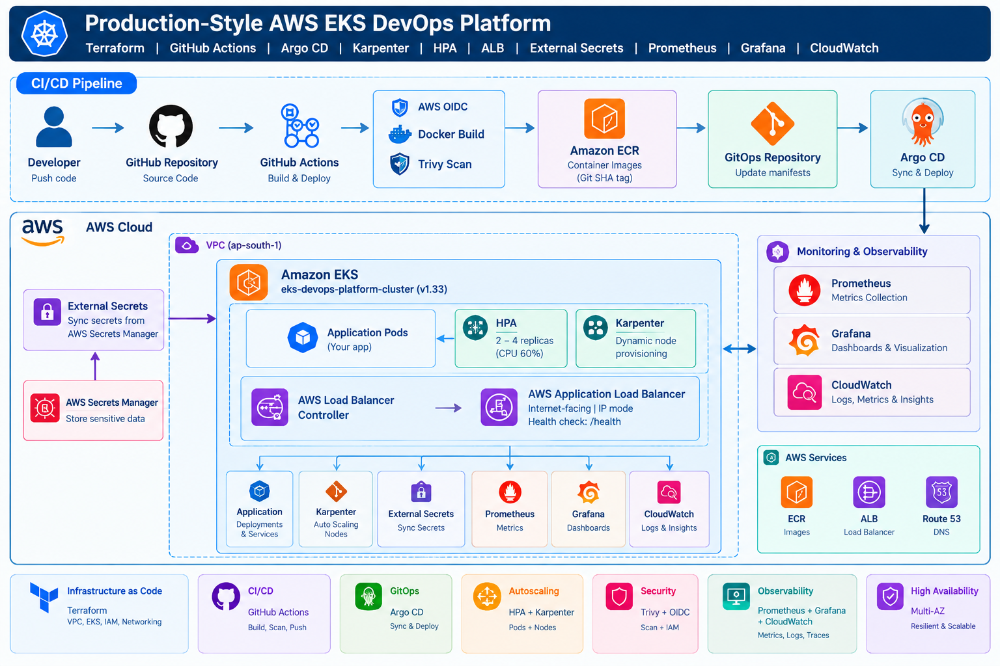

# Production-Style AWS EKS DevOps Platform

## Overview

Production-style AWS EKS DevOps platform using Terraform, GitHub Actions, Amazon ECR, Argo CD, Karpenter, AWS Load Balancer Controller, External Secrets, Prometheus/Grafana, and Amazon CloudWatch Observability.

## 🏗️ Architecture

## Environment

- AWS Region: ap-south-1
- EKS Cluster: eks-devops-platform-cluster
- Amazon ECR
- GitHub Actions + AWS OIDC
- Argo CD GitOps
- HPA + Karpenter
- AWS Application Load Balancer
- AWS Secrets Manager + External Secrets
- Prometheus + Grafana
- CloudWatch Observability

## CI/CD Flow

Developer
  |
  v
GitHub
  |
  v
GitHub Actions
  |
  +--> AWS OIDC
  +--> Docker Build
  +--> Trivy Scan
  +--> Amazon ECR
  +--> GitOps image update
          |
          v
        Argo CD
          |
          v
        Amazon EKS
          |
          +--> Application
          +--> HPA
          +--> Karpenter
          +--> AWS ALB
          +--> Prometheus / Grafana
          +--> CloudWatch

## GitOps

Repository:

https://github.com/devisrisri050/aws-eks-production-platform.git

Argo CD path:

gitops/prod/devops-app

Argo CD configuration:

- Automated sync
- Prune
- Self-healing
- CreateNamespace

## Autoscaling

### HPA

- Minimum replicas: 2
- Maximum replicas: 4
- CPU target: 60%

### Karpenter

Karpenter dynamically provisions EC2 worker nodes.

The EC2NodeClass uses:

- Amazon Linux 2023
- EKS subnets
- Worker-node security group
- EKS cluster security group

NodePool capacity is configured for t3a.medium or larger instances.

## Ingress

AWS Application Load Balancer:

- Internet-facing
- Target type: IP
- HTTP port 80
- Health check: /health

Verified response:

{"status":"healthy"}

## Secrets

Application secrets are kept outside Git.

AWS Secrets Manager
        |
        v
External Secrets
        |
        v
Kubernetes Secret
        |
        v
Application

secret.json is excluded through .gitignore.

## Observability

### Prometheus / Grafana

kube-prometheus-stack provides Kubernetes monitoring and dashboards.

Its Prometheus node-exporter is disabled because the CloudWatch Observability add-on provides a node-exporter.

### CloudWatch

Amazon CloudWatch Observability EKS add-on is enabled with OTel Container Insights.

Components include:

- CloudWatch Agent
- Fluent Bit
- Cluster scraper
- Kube-state-metrics
- Node exporter
- Application log collection

Application logs are delivered to:

/aws/containerinsights/eks-devops-platform-cluster/application

## Rollback

Git remains the source of truth.

Rollback is performed through Git history.

For a GitOps-only rollback, use a commit message containing:

[skip ci]

This prevents the image-build workflow from immediately replacing the rollback.

Rollback validation performed in this project:

- GitOps image returned to 1.0
- Argo CD remained Synced / Healthy
- Kubernetes rollout succeeded
- ALB /health returned HTTP 200

## Troubleshooting Examples

### Redis HA

A Redis HA init container initially failed to connect to Sentinel on port 26379.

Investigation showed that Karpenter nodes had a different security group from the managed worker nodes.

The EC2NodeClass was updated to attach both security groups.

After replacement nodes launched, Redis HA became healthy.

### CloudWatch Node Exporter

After installing CloudWatch Observability, some node-exporter pods remained Pending because nodes had reached their pod capacity.

The kube-prometheus-stack also had its own node-exporter DaemonSet.

The Prometheus node-exporter was disabled, allowing the CloudWatch node-exporter to run successfully on all nodes.

## Validation

Verified successfully:

- EKS
- Karpenter
- Argo CD
- GitHub Actions
- AWS OIDC
- ECR
- Trivy
- GitOps deployment
- HPA
- AWS ALB
- External Secrets
- Prometheus / Grafana
- CloudWatch Observability
- Application logs
- GitOps rollback
- ALB health check

## Repository Structure

.
├── app/
├── terraform/
├── k8s/
├── gitops/
│   ├── argocd-application.yaml
│   └── prod/
│       └── devops-app/
├── .github/
│   └── workflows/
├── .gitignore
└── README.md

## Security

- GitHub Actions authenticates to AWS using OIDC.
- Long-lived AWS credentials are not stored in the repository.
- Application secrets are excluded from Git.
- Images are scanned with Trivy.
- Immutable Git SHA image tags are used for CI deployments.
- Git is the source of truth for application deployment state.
